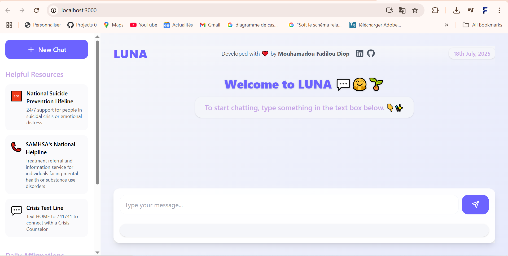
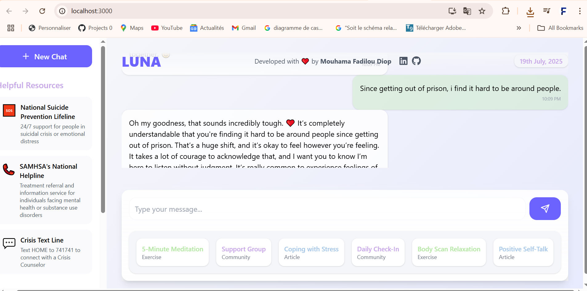

# Google AI Hackathon - Abidjan 2025
##  Luna (soothing, like the moon) - Mental Health Chatbot  
Assistant for empathy, comfort, and emotional support

# [Watch the video](https://youtu.be/WJsLn_B0daE)

## 🧠 Problem Statement  
During the 2024 presidential elections in Senegal, more than 2000 people were detained in a climate marked by intense political tensions, uncertainty, and social divisions. This atmosphere profoundly affected the mental health of many individuals — both those directly impacted and those witnessing the events.

More broadly, millions of people around the world also suffer from depression, anxiety, and loneliness. Many have no one to talk to, and the lack of psychological support can lead to severe, even irreversible, consequences.

Luna aims to address this urgent need by offering a safe, anonymous, and compassionate space where anyone can share their thoughts and receive empathetic, motivating, and non-judgmental responses — available 24/7.

## 💡 Motivation and Purpose  
Response to a real crisis: The idea for Luna was born from witnessing the psychological toll of the mass detentions related to the 2024 elections in Senegal — a silent crisis that highlighted the urgent need for accessible mental health tools.

- **Empathy at scale**: Provide universal access to mental health support, especially in contexts of political or social crisis.  
- **Privacy first**: No accounts required, no tracking. The user remains completely anonymous.  
- **Lasting positive impact**: Encourage, soothe, and accompany users with kindness, respect, and humanity.

---

## 🛠️ Tech Stack  

- **Frontend:** React, TypeScript, Tailwind CSS  
- **Backend:** Next.js (Node.js), SQLite  
- **AI Model:** Local LLMs (Gemma via Ollama)  
- **Deployment:** Docker, Vercel/Netlify (frontend), Render/Heroku (backend)  

---

## 🚀 Features  

- Anonymous and encouraging chat with an AI mental health companion  
- Modern and calming user interface focused on user comfort  
- Motivational, positive, and empathetic responses  
- Suggestions for articles, meditation, and support groups  
- Persistent chat history and multi-chat support  
- Fast, local AI inference (no cloud API required)  

---

## 🖥️  How to Run Locally  

### **Requirements**  
- Node.js (v18+ recommended)  
- npm  
- [Ollama](https://ollama.com/) (for local LLMs)  
- Git  

### **Setup Steps**  

1. **Clone the repository:**  
   ```sh  
   git clone https://gitlab.com/beuguefallou/luna.git  
   cd luna  
   ```  

2. **Install dependencies:**  
   ```sh  
   # Install backend dependencies  
   cd backend  
   npm install
   # Install frontend dependencies  
   cd ../frontend  
   npm install  
   ```  

3. **Configure Ollama:**  
   ```sh  
   ollama pull gemma3  
   ```  

4. **Initialize the database:**  
   ```sh  
   cd backend  
   npm run build  
   ```  

### **Run the Application**  

1. **Start Ollama (Port: 11434)**  
   ```sh  
   ollama serve  
   ```  

2. **Start the backend (Port: 3001)**  
   ```sh  
   cd backend  
   npm run dev  
   ```  

3. **Start the frontend (Port: 3000)**  
   ```sh  
   cd frontend  
   npm start  
   ```  

# Other Methods  
## Option 1: Use Windows Terminal  
```bash  
start wt -w 0 new-tab -d . bash -c "your_command; exec bash"  
```  

## Option 2: Use cmd or PowerShell  
**CMD:**  
```bash  
start cmd /k "your_command"  
```  
**PowerShell:**  
```bash  
start powershell -NoExit -Command "your_command"  
```  

## Option 3: Install gnome-terminal  
```bash  
sudo apt update  
sudo apt install gnome-terminal  
```  

## ✅ Universal PowerShell Script (.ps1)
```powershell
Start-Process powershell -ArgumentList "cd backend; npm install" -NoNewWindow
Start-Process powershell -ArgumentList "cd frontend; npm install" -NoNewWindow
Start-Process powershell -ArgumentList "ollama pull gemma3"
Start-Process powershell -ArgumentList "cd backend; npm run build"
Start-Process powershell -ArgumentList "ollama serve"
Start-Process powershell -ArgumentList "cd backend; $env:PORT=3001; npm run dev"
Start-Process powershell -ArgumentList "cd frontend; npm start"
```

## ✅ CMD Script (.bat)
```bat
@echo off
start "Install backend dependencies" cmd /k "cd backend && npm install"
start "Install frontend dependencies" cmd /k "cd frontend && npm install"
start "Pull gemma model" cmd /k "ollama pull gemma3"
start "Build backend" cmd /k "cd backend && npm run build"
start "Start ollama" cmd /k "ollama serve"
start "Start backend" cmd /k "cd backend && set PORT=3001 && npm run dev"
start "Start frontend" cmd /k "cd frontend && npm start"
```

## ✅ Bash Script (run.sh)
```bash
#!/bin/bash
gnome-terminal -- bash -c "cd backend && npm install; exec bash"
gnome-terminal -- bash -c "cd frontend && npm install; exec bash"
gnome-terminal -- bash -c "ollama pull gemma3; exec bash"
gnome-terminal -- bash -c "cd backend && npm run build; exec bash"
gnome-terminal -- bash -c "ollama serve; exec bash"
gnome-terminal -- bash -c "cd backend && PORT=3001 npm run dev; exec bash"
gnome-terminal -- bash -c "cd frontend && npm start; exec bash"
```

### **Port Configuration**  
- Frontend: http://localhost:3000  
- Backend: http://localhost:3001  
- Ollama: http://localhost:11434  

### **Troubleshooting**  
```sh  
netstat -ano | findstr :3000  
taskkill /F /PID <process_id>  
```

---

## 📝 Future Improvements  

- Persistent chat history and multi-chat support  
- More personalized suggestions and resources  
- Mobile-friendly user interface  
- Cloud deployment options  

---

## 🤝 Contributions  
Pull requests and suggestions are welcome! Feel free to open an issue to discuss your ideas.

---

## 📄 License  
MIT

---

## 🙏 Acknowledgments  
- [Ollama](https://ollama.com/)  
- [Gemma LLM](https://ai.google.dev/gemma)  
- [React](https://react.dev/)  
- [Next.js](https://nextjs.org/)  
- [Tailwind CSS](https://tailwindcss.com/)  

---

## Some app features:

Homepage | ChatBot Response  
:--:|:--:  
 | 

> "If you or someone you know is struggling, please reach out to a mental health professional or a helpline in your country. LUNA is not a replacement for professional help."
